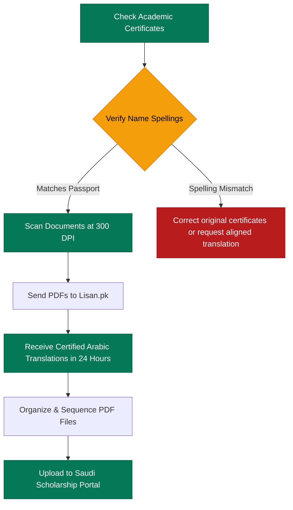

  🚨 undergraduate Deadline Alert: Only 9 Days Left Before May 21! Secure Certified Arabic Translation in 24 Hours — <a href="https://wa.me/923044296295?text=Hi%20Lisan.pk,%20I'm%20applying%20for%20a%20Bachelor%20scholarship%20and%20need%20urgent%20Arabic%20translation%20for%20my%20Matric%20and%20Inter%20certificates." class="underline hover:text-white">WhatsApp Now</a>

Many students preparing for Saudi scholarship applications are now facing the same problem: they are unsure which documents are actually required before submission closes.

With **only 9 days left** before the 21 May deadline, students are rushing to prepare transcripts, recommendation letters, passports, and certificates. But many applicants discover too late that incomplete documentation, missing Arabic translations, or formatting mistakes can delay or even ruin the entire application process.

This comprehensive guide explains the documents usually required for bachelor (undergraduate) scholarship applications, common mistakes undergraduate students make, and how to prepare your scholarship files correctly before the deadline closes.

---

## Why Many Bachelor Scholarship Applications Get Delayed

A large number of students focus only on admission forms and IELTS preparation while completely ignoring document formatting and translation requirements. 

This becomes a critical bottleneck near submission deadlines because Saudi university portals often request:

*   **Certified Arabic translations** of high school and secondary records.
*   **Certified academic documents** matching original transcripts.
*   **Translated certificates, stamps, and seals**.
*   **Complete PDF submissions** structured in exact sequences.
*   **Properly scanned, legible files** under strict size limits.

Several prestigious Saudi scholarship programs and universities are currently accepting international applications for the 2026 cycle, with some major deadlines closing on **21 May 2026**.

Students often realize documentation issues at the final stage when they are:
- Uploading files to the admission portal
- Verifying application sections before submission
- Preparing Cultural Attaché or embassy requirements
- Reviewing official submission checklists

That delay becomes extremely risky when deadlines are only a few days away.

> [!IMPORTANT]
> **Pull Quote:**
> “Many students spend months preparing for scholarships but delay document translation until the final week.”

---

## Complete Bachelor Scholarship Document Checklist for 2026

Students applying for undergraduate scholarships should prepare their documents early instead of waiting for the final weekend. 

Ensure you have organized the following three document categories:

### 1. Academic Documents
Most bachelor scholarship applications commonly require:
*   **Matric Certificate** (Secondary School Certificate - SSC)
*   **Intermediate Certificate** (Higher Secondary School Certificate - HSSC)
*   **Academic Transcripts** / Detail Marks Certificates (DMCs)
*   **Equivalency Certificates** (if high school was completed outside Pakistan or through O/A Levels)
*   **School Result Cards** or provisional board certificates
*   **Character Certificate** issued by your last attended college

> [!NOTE]
> If you are searching for:
> *   *“matric and inter certificate translation”*
> *   *“transcript translation for scholarship application”*
> *   *“educational document translation for undergraduate students”*
> 
> You must ensure that both your original certificates and their verified translations are prepared side-by-side.

### 2. Identity Documents
*   **Valid Passport** (with at least 6 months validity)
*   **CNIC** (National Identity Card) or **B-Form** (if under 18)
*   **Passport-size photographs** with a white background

### 3. Supporting Documents
*   **Statement of Purpose (SOP)** explaining your educational goals
*   **Recommendation Letters** (at least two from your high school teachers)
*   **Medical Certificate** (certified by a registered practitioner)
*   **Extracurricular Certificates** and sports achievements
*   **Volunteer Experience Documents**

Organizing these files early reduces last-minute stress and ensures an error-free portal upload.

---

## Which Documents Usually Need Arabic Translation?

One of the biggest mistakes undergraduate students make is assuming English documents are always enough.

Many Saudi universities and scholarship systems may request certified Arabic translations for:
1.  **Transcripts and Marks Sheets** (DMCs)
2.  **Matric / Secondary School Certificates**
3.  **Intermediate / Higher Secondary Certificates**
4.  **Passport Information Page**
5.  **Supporting Academic Records and Certificates**

Saudi educational institutions are increasingly strict about proper academic documentation and submission formatting.

---

## Why Professional Academic Translation Matters

Using machine translation or unverified resources can trigger immediate rejection. Incorrect translations create costly problems such as:

*   **Wrong Course Names:** Inaccurate translation of subjects (e.g., converting science majors into unrelated Arabic terms).
*   **Inconsistent Grades:** Mismatched grading system conversions or GPA wording.
*   **Passport Spelling Mismatches:** Spelling your name differently on the translation than your official passport data.
*   **Untranslated Stamps:** Overlooking board, HEC, or MoFA attestation stamps.
*   **Formatting Issues:** Changing the table structure or layout of the original certificate.

### The Risk of Non-Professional Translators
Students sometimes use Google Translate, cheap freelancers, or non-academic translators to save a few hundred rupees. This often creates severe errors in educational terminology. 

In contrast, professional [Saudi scholarship document support](/services/educational-translation) focuses on **accurate terminology, consistent formatting, complete page translation, and readable document structure** that admission officers can verify instantly.

---

## Common Scholarship Document Mistakes Undergraduate Students Make

Many undergraduate students are applying for international scholarships for the first time. Small, overlooked mistakes can create unnecessary complications.

### 1. Incorrect Translations & Spelling
Common issues include incorrect department names, inaccurate grade conversion terms, spelling mistakes, and inconsistent surnames across transcripts.

### 2. Low-Quality Scans
Poor scans may cause unreadable stamps, blurry signatures, cropped margins, or rejected uploads. Always use a flatbed scanner or professional scanning mobile app.

### 3. Name Mismatches
Your passport, certificates, transcripts, and recommendation letters should all use the same spelling format. Even minor differences in initials or spacing can create verification problems.

---

## Only 9 Days Left: Why Students Should Prepare Documents Early

Students often underestimate how long scholarship preparation takes. After collecting your physical documents, you may still need to handle:

*   Document corrections
*   Board or MOFA attestation
*   PDF sizing and file conversion
*   Certified Arabic translation review
*   Structured file organization

Some Saudi university admissions have already closed earlier this month, showing how quickly deadlines move and how little flexibility remains. Waiting until the final days increases the risk of incomplete submissions, rushed translation errors, formatting mistakes, and missed deadlines.

> [!TIP]
> **Pull Quote Suggestion:**
> "Incorrect academic translation and incomplete files are among the most common scholarship submission problems. Get your files processed by experts early."

---

## How Students Can Translate Scholarship Documents Online

Many students cannot visit physical translation offices because they are studying full-time, living in different cities, managing multiple university applications, or working under tight deadlines.

Fortunately, Lisan.pk provides high-quality [online academic translation help](/contact) that allows you to:
- Send your document PDFs through WhatsApp.
- Receive digital, certified PDF copies within hours.
- Process urgent translations remotely without office visits.
- Review and approve draft files quickly before final submission.

This is especially important with the **21 May** scholarship deadline approaching fast.

### Processing Timeline for Scholarship Document Translation

| Service Type | Estimated Time | Best For |
| :--- | :--- | :--- |
| **Standard Translation** | 2–3 Days | Students preparing supporting letters and certificates |
| **Urgent Translation** | 24 Hours | Rapid turnaround for Matric/Inter certificates & DMCs |
| **Same-Day Processing** | Under 12 Hours | Critical corrections for urgent same-day uploads |

---

## Don’t Let Document Mistakes Ruin Your Scholarship Opportunity

Students spend months preparing IELTS exams, collecting board certificates, and writing personal statements. Losing a lifetime scholarship opportunity because of translation delays or minor document mistakes is completely avoidable.

With Saudi scholarship deadlines closing on **21 May**, now is the time to organize your documents, review your translations carefully, and prepare professional academic files before submission pressure becomes overwhelming.

### Get Expert Help Today!

Our expert translation team is online to assist you with same-day translations, board certificate reviews, and Saudi portal compatibility checks.

*   **WhatsApp Helpline:** [**0304-4296295**](https://wa.me/923044296295?text=Hi%20Lisan.pk,%20I%20need%20urgent%20academic%20translation%20for%20my%20bachelor%20scholarship%20documents%20before%20the%2021%20May%20deadline.)
*   **Get a Free Quote Online:** Submit your files through our **[Contact Form](/contact)**.

---

### External Scholarship & Portal Resources
*   [Jazan University International Scholarships Announcement](https://ju.edu.sa/en/announces-admission-international-scholarships-1448-ah) — High school criteria and deadlines.
*   [King Abdulaziz University Undergraduate Scholarships](https://opportunitiescorners.com/king-abdulaziz-university-scholarship-2026/) — Full program requirements.
*   [KAUST Undergraduate & Graduate Timelines](https://admissions.kaust.edu.sa/how-to-apply/admission-timelines) — Direct portal deadlines.
*   [Saudi Ministry of Education Scholarship Conditions](https://sites.moe.gov.sa/scholarship-program/conditions/info-4/) — Mandatory documentation guides.

---

### About the Author
**Lisan.pk** is Pakistan’s leading professional Arabic academic translation agency. We assist hundreds of Pakistani students every year with Saudi-compliant translations, HEC/IBCC credential mapping, and urgent deadline support.
