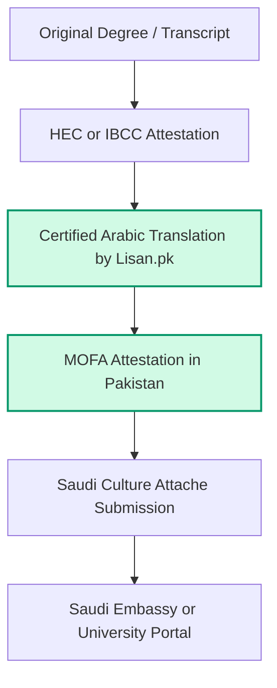

Saudi scholarship applications and university admissions are becoming increasingly competitive for Pakistani students. One small mistake in your academic documents can delay your admission process, scholarship verification, or embassy submission.

At **Lisan.pk**, we regularly help students who are confused about HEC attestation, IBCC verification, Arabic translation requirements, Saudi university compliance, transcript formatting, and educational terminology accuracy.

Many applicants assume simple translation is enough. **It is not.**

Saudi universities and scholarship authorities carefully verify:
*   Academic terminology compliance
*   Document and table formatting
*   Translator certification validity
*   Passport spelling consistency
*   Official attestation status

This is especially important because Saudi Arabia’s education sector continues expanding rapidly. According to Saudi Arabia’s Ministry of Education data, higher education enrollment exceeded 1.57 million students in 2024, reflecting increasing international academic demand. ([Saudi Press Agency - spa.gov.sa](https://www.spa.gov.sa))

That growth has increased the demand for:
*   **HEC attested degree Arabic translation Pakistan**
*   **Transcript translation Arabic Pakistan**
*   **Saudi scholarship document translation services**
*   **Arabic translation for attested educational documents**

In this guide, we explain the complete Saudi educational document translation process, common rejection reasons, attestation workflow, and how our team at Lisan.pk helps students avoid scholarship and admission delays.

---

## Why Saudi Universities Require Arabic Translation

Many Saudi universities require Arabic translation for degrees, transcripts, equivalence certificates, IBCC documents, and HEC verified records.

At Lisan.pk, we frequently assist students applying for:
*   Fully funded Saudi scholarships
*   Postgraduate admissions (MS/PhD)
*   Undergraduate programs
*   Saudi Culture Attache submissions
*   Embassy processing

Saudi universities carefully verify academic records because educational compliance directly affects admission eligibility. According to Saudi Vision 2030 educational expansion reporting, Saudi Arabia continues investing heavily in international education and scholarship infrastructure. ([Saudi Vision 2030 - vision2030.gov.sa](https://www.vision2030.gov.sa))

This has significantly increased the demand for accurate, certified educational Arabic translation services.

---

## Which Educational Documents Need Arabic Translation?

At Lisan.pk, we provide academic document Arabic translation Pakistan students commonly require for multiple educational categories:

| Document Category | Purpose & Need | Lisan.pk Services |
| :--- | :--- | :--- |
| **Degrees & Diplomas** | Mandatory for university admission, embassy submissions, and employment visas. | [HEC Attested Degree Arabic Translation](/services/translation/academic-degree-transcript) / [Attested Degree Translation Saudi Arabia](/blog/saudi-embassy-attested-document-translation-process-pakistan) |
| **Transcripts & Marksheets** | Sensitive GPA, credit hour, and course translation. | [Transcript Translation Arabic Pakistan](/services/translation/academic-degree-transcript) / [HEC Attested Transcript Arabic Translation](/blog/saudi-embassy-approved-translation-pakistan) |
| **IBCC Certificates** | Matric/Intermediate equivalence verification for undergraduate admissions. | [IBCC Certificate Translation Arabic Pakistan](/blog/saudi-embassy-rejection-translation-fix-pakistan) / [IBCC Attested Certificate Translation Saudi Arabia](/blog/saudi-mofa-attested-arabic-translation-services-pakistan) |
| **Scholarship Documents** | Supporting documentation like recommendation letters, essays, and forms. | [Saudi Scholarship Document Translation Services](/blog/saudi-scholarship-document-translation-services-pakistan) |

---

## HEC Attestation Before Arabic Translation — Correct Process

One of the biggest questions students ask us is:

> [!NOTE]
> **“Should I do HEC attestation before Arabic translation?”**
>
> Yes! In the official **HEC verified degree Arabic translation workflow**, you should ideally complete HEC or IBCC attestation *first*. The translator must translate not only the degree contents but also the official HEC/IBCC verification stamps, barcodes, and signatures placed on the back of your original documents. Translating a document *before* attestation means the final stamps are omitted from your translated set, which may trigger resubmission requests from strict Saudi scholarship review boards.

At Lisan.pk, we guide students according to their scholarship category, university requirements, embassy requirements, and current attestation status. This helps reduce workflow confusion and processing delays.

---

## Common Reasons Saudi Universities Reject Educational Translations

This is where many students become stressed because deadlines are often very close. At Lisan.pk, we regularly help applicants fix issues caused by low-quality, cheap translators.

### 1. Incorrect Academic Terminology
Saudi universities carefully review course titles, degree names, grading systems, and educational terminology. Machine translation (like Google Translate) often creates major academic wording errors (e.g., translating "Mechanical Engineering" literally or misinterpreting GPA details). 

A recent translation quality analysis found that academic and legal terminology are among the most common causes of certified translation rejection globally. ([Linguation Studies - linguation.com](https://www.linguation.com)) That is why we use professional human Arabic translators familiar with academic documentation.

### 2. Passport Spelling Mismatch
Even one spelling inconsistency between your passport, original degree, transcript, and translated documents can create identity verification problems. Lisan.pk performs strict quality control checks to verify names perfectly before final delivery.

### 3. Missing Certification or Stamps
Many rejected educational translations are missing a translator signature, certification declaration, or official registered stamp. Saudi institutions require professionally certified translations of all supporting records.

### 4. Poor Formatting
Educational transcripts feature grids, credit hours, signatures, and board headers. Poor layout design can cause confusion and delays during university review. Lisan.pk maintains 1:1 original formatting layout consistency for all translated transcripts.

---

## Saudi Scholarship Arabic Translation Requirements

Saudi scholarship applications require more than basic translation. Students must ensure:
*   Academic terminology accuracy
*   Attestation compliance (HEC/IBCC verified)
*   Official translator certification
*   Exact passport spelling consistency
*   Proper grid and table formatting

Saudi Arabia’s scholarship ecosystem continues expanding rapidly. According to Saudi Ministry reporting, the Kingdom continues increasing educational internationalization initiatives under Vision 2030. ([Saudi Vision 2030 - vision2030.gov.sa](https://www.vision2030.gov.sa))

At Lisan.pk, we help students prepare their **Arabic translation for Saudi Culture Attache Pakistan** submissions, scholarship application documents, and **Saudi university document translation Pakistan** sets with complete peace of mind.

---

## Why Students Across Pakistan Trust Lisan.pk

At **Lisan.pk**, we specifically focus on Saudi-related educational Arabic translation workflows. Unlike generic translation providers, we understand:
*   Saudi scholarship portal requirements (KSU, KAU, Madinah, etc.)
*   Saudi university documentation and terminal standards
*   Academic terminology accuracy
*   HEC/IBCC verification workflows
*   Saudi Embassy compliance standards

We provide certified educational Arabic translation, official stamps and signatures, Saudi-compliant formatting, expert academic terminology verification, and nationwide courier delivery. Our goal is to help students reduce rejection risk and secure their academic futures without documentation stress.

### Nationwide Courier Delivery Across Pakistan
Students from all major cities can submit their original scans online and receive translated, certified, and stamped hard copies via nationwide courier:
*   Lahore
*   Islamabad
*   Karachi
*   Rawalpindi
*   Faisalabad
*   Multan
*   Peshawar
*   Sialkot
*   Other cities nationwide

### WhatsApp Document Review Support
Students can send educational documents directly through WhatsApp for professional review before translation begins. 

---

## Need Certified Saudi Educational Translation?

Don't let minor spelling mistakes or weak academic translation ruin your Saudi scholarship dreams. Get your degrees and transcripts translated by native Arabic experts.

### Contact Educational Translation Experts

👉 **[WhatsApp Consultation: Chat on WhatsApp (+92-304-4296295)](https://wa.me/923044296295?text=Hi%20Lisan.pk,%20I%20need%20help%20with%20HEC%20attested%20degree%20Arabic%20translation%20services.)**  
👉 **[Request a Free Certified Translation Quote Online](/contact)**

---

### About the Author
The **Lisan.pk Editorial Team** specializes in Saudi-focused Arabic translation, educational document translation, scholarship paperwork, and embassy-compliant Arabic language services in Pakistan. Our team regularly assists students applying for Saudi scholarships, university admissions, and academic attestation workflows.

### External Resources for Students
*   [Higher Education Commission (HEC) Pakistan](https://www.hec.gov.pk) — Official HEC degree attestation portal.
*   [Saudi Ministry of Education](https://moe.gov.sa) — Rules and procedures for international students.
*   [Study in Saudi Platform](https://studyinsaudi.moe.gov.sa) — Unified scholarship and university admissions platform.
