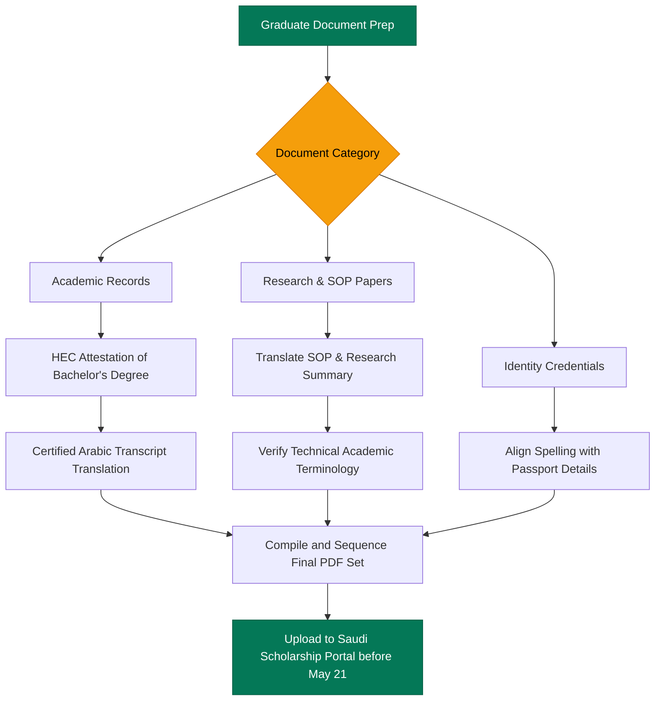

  🚨 Masters Priority Alert: Only 9 Days Remaining Before May 21! Secure Certified Arabic Translation in 24 Hours — <a href="https://wa.me/923044296295?text=Hi%20Lisan.pk,%20I'm%20applying%20for%20a%20Master's%20scholarship%20and%20need%20urgent%20Arabic%20translation%20for%20my%20degree,%20transcripts,%20and%20research%20documents." class="underline hover:text-white">WhatsApp Now</a>

Many students applying for master’s scholarships spend months preparing research proposals, improving academic profiles, and writing statements of purpose. But close to the deadline, document preparation becomes one of the biggest challenges.

With **only 9 days left** before the 21 May Saudi scholarship deadline, many applicants are still unsure which documents require Arabic translation, how academic files should be formatted, and what mistakes can create delays or rejections during submission.

This guide explains the complete master’s scholarship document checklist, common translation mistakes, and how students can prepare professional scholarship applications before deadlines close.

---

## Why Masters Scholarship Applications Get Delayed

Master’s applications usually involve more complex, specialized documentation than undergraduate admissions. Unlike high school entries, graduate applicants must submit:

*   **Detailed Research Proposals** with specific scientific terminology.
*   **Recommendation Letters** reflecting specific academic strengths.
*   **Academic Transcripts** outlining semester-wise credits and subject codes.
*   **Professional Experience Documents** verifying research or teaching history.
*   **Statement of Purpose (SOP) Files** outlining prospective research goals.
*   **Certified Academic Records** featuring HEC, board, or MoFA attestation stamps.

Several Saudi universities and scholarship programs are currently processing international applications for the 2026 cycle, with major deadlines ending on **21 May 2026**.

Many applicants only discover translation or formatting problems during:
- Final submission on the university portal
- Application verification checks
- In-depth document review by the admissions board
- Preparing embassy and Cultural Attaché requirements

At that stage, even minor issues can delay your application, causing unnecessary stress and missed opportunities.

> [!IMPORTANT]
> **Pull Quote:**
> “Many scholarship applicants prepare strong academic profiles but underestimate how much time document preparation actually requires.”

---

## Complete Masters Scholarship Document Checklist

Students applying for master’s scholarships abroad should organize their documents early instead of waiting until the final week. 

Ensure you have prepared the following file sets:

### 1. Academic Documents
Most master’s scholarship applications commonly require:
*   **Bachelor's Degree Certificate** (attested by HEC)
*   **Academic Transcripts** (Semester-wise or consolidated marks sheets)
*   **Equivalency Certificates** (issued by HEC for international degrees)
*   **Graduation Certificates** or provisional awards
*   **Academic Result Cards** with official GPA grading scales

> [!NOTE]
> If you are searching for:
> *   *“masters degree transcript translation service”*
> *   *“certified translation for masters application”*
> *   *“documents required for masters scholarship abroad”*
> 
> Remember that having a professional [transcript translation for scholarship applications](/blog/translate-degree-transcript-arabic-saudi-admission) is mandatory for almost all Saudi graduate portals.

### 2. Research and Professional Documents
*   **Statement of Purpose (SOP)** (usually required in both English and Arabic)
*   **Research Proposal** detailing your intended thesis topic
*   **CV or Resume** highlighting scientific contributions
*   **Experience Certificates** (from employers or universities)
*   **Publications** or published research summaries

### 3. Identity and Legal Documents
*   **Valid Passport** (personal details page)
*   **CNIC** (Computerized National Identity Card)
*   **Passport-size photographs** (white background, professional attire)

Preparing these files early helps you avoid last-minute confusion and portal upload errors.

---

## Which Documents Usually Need Arabic Translation for Masters Admission?

Saudi universities are increasingly strict about proper academic documentation and submission formatting. Portals regularly request certified Arabic translation for:

1.  **Academic Transcripts** (subject names, credit hours, GPA wording)
2.  **Bachelor's Degrees** (university name, specialization, award dates)
3.  **HEC Equivalency Certificates**
4.  **Passport Details Page**
5.  **Academic Recommendation Letters**
6.  **SOP and Research-Related Summaries**

---

## Why Accurate Academic Translation Matters

Master’s applications involve technical and academic terminology that requires extremely careful, domain-specific translation. Incorrect translation of technical terms can completely alter the perceived value of your research background.

### Terminology Rejection Risks
*   **Research Titles:** Misrepresenting specialized scientific terms in your thesis title.
*   **Department Names:** Inaccurate translation of specialized faculties.
*   **Thesis Terminology:** Misinterpreting technical methodology names.
*   **GPA Wording:** Translating complex grading criteria inconsistently.
*   **Specialization Names:** For example, translating *“Materials Science”* or *“Applied Mathematics”* into generic, non-academic Arabic.

These issues can lead to misunderstandings of your academic background, resulting in verification delays and application rejection. 

Using professional [Arabic academic translation services](/services/arabic-translation) instead of Google Translate or cheap freelancers ensures **terminology accuracy, document consistency, proper formatting, and readable structure** designed for admissions boards.

---

## Common Translation Mistakes That Can Affect Masters Scholarship Approval

Many graduate students underestimate how important academic formatting and consistency are.

### 1. Research Terminology Errors
Poor translations may incorrectly represent thesis topics, technical research fields, scientific methodology, or specific specialization titles, making your profile look weak or confusing.

### 2. Statement of Purpose Formatting Issues
Admissions committees expect elegant, easy-to-read SOP files. Mistakes include poorly formatted margins, spelling inconsistencies, unreadable scan qualities, or using varying name styles.

### 3. Recommendation Letter Inconsistencies
Letters written by professors must use consistent spellings matching your passport, professional formatting, and proper translator stamps if originally written in English or Urdu.

---

## Only 9 Days Left: Why Masters Students Should Prepare Documents Now

Master’s scholarship applications usually require significantly more verification, attestation, and document review than bachelor applications. 

Before final upload, students may still need to complete:
*   Original document attestation from HEC and MoFA
*   Typo corrections from original universities
*   Complex PDF merging and sizing updates
*   In-depth certified translation reviews
*   Blurred page scan replacements

Some Saudi university admissions have already closed earlier this month, showing how quickly scholarship portals can stop accepting applications. Waiting until the final days increases the risk of incomplete applications, rushed translations, incorrect formatting, and missed deadlines.

> [!TIP]
> **Pro Tip:**
> "Research terminology errors and inconsistent academic formatting are among the most common scholarship document problems. Always have your translation verified by a certified team before final submission."

---

## How Students Can Translate Masters Scholarship Documents Online

Many graduate applicants cannot visit physical offices because they are managing multiple applications, working professionally, studying full-time, or living in different cities.

Fortunately, Lisan.pk provides professional [educational document translation support](/services/educational-translation) online. Our digital workflow allows you to:
- Send your academic PDFs easily through WhatsApp.
- Receive digital, certified translation files quickly in high resolution.
- Process urgent translations remotely.
- Review and approve technical terminology drafts before final printing.

This becomes especially important with the **21 May** scholarship deadline approaching.

### Translation Timeline for Urgent Masters Applications

| Service Type | Estimated Processing Time | Recommended For |
| :--- | :--- | :--- |
| **Standard Translation** | 2–3 Days | Comprehensive portfolios with multiple research papers |
| **Urgent Translation** | 24 Hours | Degrees, semester transcripts, and SOP files |
| **Same-Day Processing** | Under 12 Hours | Critical final-stage corrections for selected documents |

---

## Don’t Let Translation Delays Affect Your Scholarship Opportunity

Students spend months building strong academic profiles, preparing research documents, and planning scholarship applications. Delays caused by incomplete translation or document formatting issues are completely avoidable.

With Saudi scholarship deadlines closing on **21 May**, students should now focus on organizing files, reviewing academic documents carefully, and preparing professional translations before submission pressure increases further.

### Get Expert Help Today!

Our specialized graduate support team is online to assist you with same-day translations, technical research term checks, and portal-ready PDF sequencing.

*   **WhatsApp Helpline:** [**0304-4296295**](https://wa.me/923044296295?text=Hi%20Lisan.pk,%20I%20need%20urgent%20academic%20translation%20for%20my%20Masters%20scholarship%20documents%20before%20the%2021%20May%20deadline.)
*   **Get a Quick Free Quote:** Submit your files to our **[Contact Form](/contact)** for an [urgent online translation assistance](/contact) review.

---

### External Graduate Scholarship Resources
*   [King Abdulaziz University Graduate Scholarship Portal](https://opportunitiescorners.com/king-abdulaziz-university-scholarship-2026/) — Admission timelines.
*   [Saudi Ministry of Education Scholarship Conditions](https://sites.moe.gov.sa/scholarship-program/conditions/info-4/) — Detailed academic guidelines.
*   [Jazan University Graduate Scholarships Announcement](https://ju.edu.sa/en/announces-admission-international-scholarships-1448-ah) — High-study timelines.
*   [KAUST Graduate admissions timeline](https://admissions.kaust.edu.sa/how-to-apply/admission-timelines) — Timelines and selection criteria.

---

### About the Author
**Lisan.pk** is Pakistan's premier professional academic translation agency. We support master’s and doctoral candidates applying to top-tier Middle Eastern programs with secure translation workflows, certified stamps, and technical research vocabulary alignment.
