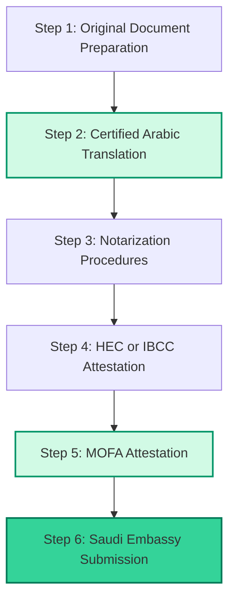

Applying for a Saudi work visa, scholarship, university admission, family visa, or commercial submission in Pakistan can feel like navigating a complex maze. Most applicants are completely confused about how to manage translation, notarization, attestation, and legalization. 

At **Lisan.pk**, we regularly help applicants who are completely stressed by the Saudi documentation process. The biggest issue they face is process order: *Should Arabic translation happen first? Is notarization required before MOFA? Does HEC attestation come before Saudi embassy submission?*

This comprehensive guide clears up all process confusion. We provide the exact **Saudi attestation translation process Pakistan** candidates need to secure **MOFA attested Arabic translation Pakistan** services with absolute confidence.

---

## What Is MOFA Attestation for Saudi Arabia?

**MOFA attestation** refers to document verification procedures connected with the Ministry of Foreign Affairs processing during international documentation workflows.

For Saudi-related applications, **Saudi document legalization Pakistan** workflows help confirm document authenticity before final embassy submission or institutional processing.

At **Lisan.pk**, we regularly assist clients who require **MOFA certified document translation Arabic** in Pakistan for:
*   Saudi work visas (employment contracts, degrees)
*   Family visa applications (Nikah Nama, FRC)
*   Scholarship submissions & Saudi university admissions
*   Legal documentation & powers of attorney
*   Commercial paperwork & business agreements

Many applicants incorrectly assume translation alone is enough. In reality, Saudi documentation workflows involve multiple verification stages that require an **attestation and translation service Pakistan Saudi** applicants can rely on.

---

## Difference Between Translation, Attestation, Legalization & Notarization

Understanding the difference between these four terms is critical because process confusion is one of the single biggest reasons applications face delays and rejection.

### 1. Certified Arabic Translation for MOFA
This is the process of professionally translating documents into Arabic while maintaining legal and academic terminology, passport spelling consistency, and official stamps. **Certified Arabic translation for MOFA** must always include the registered translator stamp, signature, and accuracy statement.

### 2. Notarization (Notarized Arabic Translation MOFA Pakistan)
Notarization is the process of validating signatures or document copies through authorized notary procedures. Some Saudi document categories may require a **notarized Arabic translation MOFA Pakistan** workflow before further attestation steps are accepted.

### 3. Attestation
Attestation is institutional verification. Depending on the document type, this may involve HEC, IBCC, educational boards, or other government departments.

### 4. Legalization (Saudi MOFA Legalization Document Translation)
Legalization refers to international document validation procedures for use in Saudi Arabia. **Saudi MOFA legalization document translation** combines all the above steps into a final verification package.

---

## Correct Saudi Document Processing Order

The exact sequence may vary depending on the document type, but at Lisan.pk, we generally guide applicants through the following order:

### Step 1 — Original Document Preparation
We review the original documents to ensure they are complete, legible, and ready for processing.

### Step 2 — Certified Arabic Translation
Lisan.pk provides official **Saudi MOFA attestation translation** services with passport spelling checks, correct formatting, and professional translator stamps. If your previous translation was rejected, read our guide on [Saudi embassy rejection translation fixes in Pakistan](/blog/saudi-embassy-rejection-translation-fix-pakistan).

### Step 3 — Notarization Procedures
We guide you on obtaining a **notarized Arabic translation MOFA Pakistan** standard if your document category (such as a power of attorney or commercial contract) requires notary verification first.

### Step 4 — HEC or IBCC Attestation
Educational degrees must be verified by HEC or IBCC. This stage is especially critical for Saudi scholarships and university admissions.

### Step 5 — MOFA Attestation
We obtain the final Ministry of Foreign Affairs (MOFA) attestation. Incorrect sequencing during this stage often creates major delays. Refer to our guide on the [Saudi embassy attested document translation process in Pakistan](/blog/saudi-embassy-attested-document-translation-process-pakistan) for deeper workflow details.

### Step 6 — Saudi Embassy Procedures
Once MOFA attestation is complete, documents proceed toward Saudi embassy submission. Having a **MOFA attested translation for Saudi embassy** verification reduces the risk of rejection to zero. Learn more about [Saudi Embassy approved translation in Pakistan](/blog/saudi-embassy-approved-translation-pakistan).

---

## Long-Tail / Conversational FAQs

We answer the most common high-intent conversational questions that applicants ask our team every day:

### Translation before or after MOFA attestation?
> [!IMPORTANT]
> **Should Arabic translation happen before or after MOFA attestation?**
>
> In the correct sequence, **certified Arabic translation should be done BEFORE MOFA attestation** if you are translating the original document text as a single set, or immediately after original attestation to ensure the translation itself carries the MOFA verification stamp. Specifically, the original document must first be attested by its respective authority (like HEC or IBCC), and then both the original document and its certified translation are submitted together to MOFA for final legalization.

### Which documents require MOFA attestation Saudi Arabia?
The documents that commonly require **Arabic translation with MOFA attestation Pakistan** processing include:
*   **Educational Certificates:** Bachelor degrees, Master degrees, transcripts, Matric, and Intermediate certificates.
*   **Family Documents:** Nikah Nama (Marriage Certificate), Birth Certificates, and Family Registration Certificates (FRC).
*   **Visa & Security Papers:** Police character certificates, experience letters, and medical reports.
*   **Commercial Documents:** Company registration certificates, business contracts, NTN, partnership deeds, and powers of attorney.

### Saudi MOFA attestation process for translated documents
The process involves obtaining a professional **MOFA approved Arabic translation services** package, ensuring the translator is registered, matching names exactly with your passport, certifying the translation, getting it notarized (if applicable), and presenting it alongside your original attested documents at the Ministry of Foreign Affairs (MOFA) counter in Islamabad, Lahore, Karachi, Peshawar, or Quetta.

### Arabic translation and legalization for Saudi visa
If you are applying for a Saudi work, residence, or family visa, you must submit **legalized document translation Saudi Arabia Pakistan** sets. Any mismatch in passport spelling, missing stamps, or weak translation will cause an immediate rejection at the visa center.

---

## Why Choose Lisan.pk for MOFA Attested Arabic Translation?

At **Lisan.pk**, we do not just translate documents — we help you manage the entire **Saudi document legalization Pakistan** process from start to finish. We are the premier **MOFA approved Arabic translation services** provider in Pakistan.

### 1. Zero Rejection Risk with Human Arabic Translators
We provide professional human **Arabic translation for MOFA Saudi Arabia** compliance. We never use machine translations or Google Translate, ensuring flawless legal, commercial, and academic phrasing.

### 2. MOFA Attestation Arabic Translation Lahore & Nationwide
Whether you need **MOFA attestation Arabic translation Lahore**, Islamabad, Karachi, Peshawar, or Rawalpindi, our digital portal allows you to order online. We provide **MOFA attested document translation services** with secure nationwide courier delivery to your doorstep.

### 3. WhatsApp Consultation & Quick Support
We review your documents over WhatsApp to verify your passport spelling and sequence before we start translating. This ensures 100% compliance.

---

## Start Your Saudi Document Legalization Today

Avoid costly delays, stress, and embassy rejection. Get your documents verified and translated by Pakistan's trusted Saudi documentation specialists.

👉 **[WhatsApp Consultation: Chat on WhatsApp (+92-304-4296295)](https://wa.me/923044296295?text=Hi%20Lisan.pk,%20I%20need%20help%20with%20Saudi%20MOFA%20attested%20Arabic%20translation%20services.)**  
👉 **[Request a Free Certified Translation Quote Online](/contact)**

---

### External Resources for Saudi Applicants
*   [Saudi Ministry of Foreign Affairs (MOFA)](https://www.mofa.gov.sa/) — Verify Saudi MoFA rules.
*   [Saudi Ministry of Education](https://moe.gov.sa/) — Guidelines for academic certifications and scholarships.
*   [Study in Saudi Platform](https://studyinsaudi.moe.gov.sa/) — Official unified international admissions portal.
